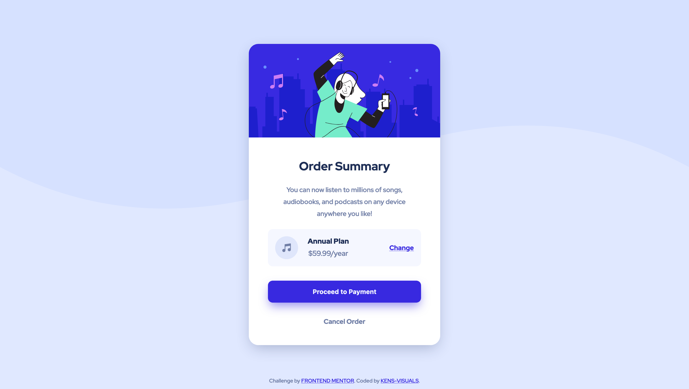
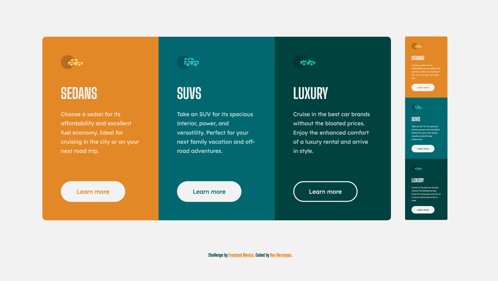
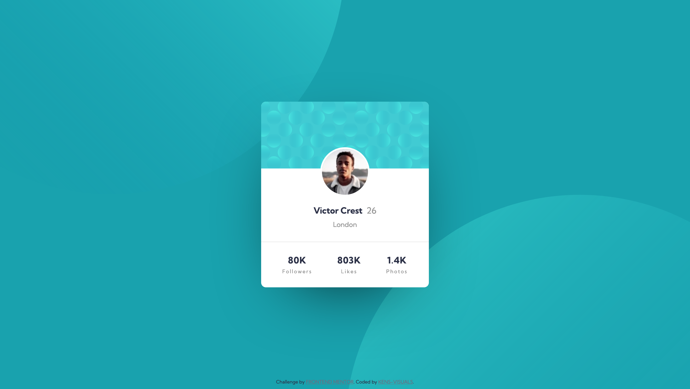
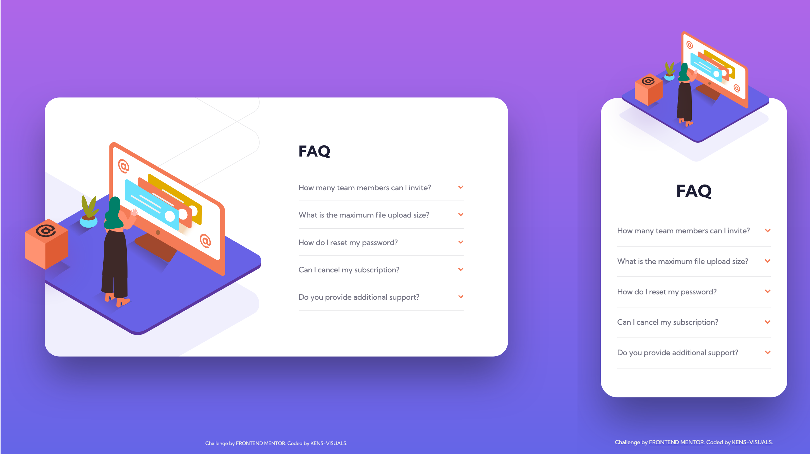
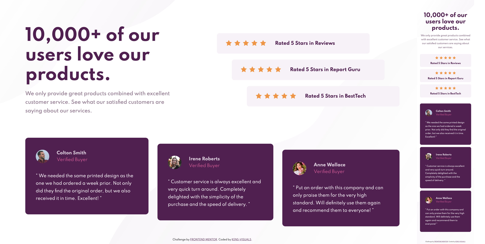

# Frontend Mentor Solutions 👨🏻‍💻

I've challenged myself to a **30-DAY-CSS-CHALLENGE,** and what other way than using Frontend Mentor's beautiful designs. I wanted this to be as challenging as it gets, hence I purposely didn't buy the pro version of Frontend Mentor's subscription, so I don't have access to any design files relying only on my vision and approximation.

> Programming is like any other sport. You might know the rules, but you have to play to learn. -- Mark Zuckerberg

| Table of Contents                                                 |
| ----------------------------------------------------------------- |
| [Order Summary Component](#order-summary-component)               |
| [3 Column Preview Card Component](#column-preview-card-component) |
| [Profile Card Component](#profile-card-component)                 |
| [FAQ Accordion Card](#faq-accordion-card)                         |
| [Stats Preview Card Component](#stats-preview-card-component)     |
| [Social Proof Section](#social-proof-section)                     |

## Order Summary Component

- Live Site URL: [https://kens-visuals.github.io/order-summary-component/](https://kens-visuals.github.io/order-summary-component/)
- Repository URL: [https://github.com/kens-visuals/order-summary-component](https://github.com/kens-visuals/order-summary-component)
- Solution URL: [https://www.frontendmentor.io/solutions/basic-card-component-using-sass-preprocessor-and-bem-naming-convention-029xmfY6X](https://www.frontendmentor.io/solutions/basic-card-component-using-sass-preprocessor-and-bem-naming-convention-029xmfY6X)

## 3 Column Preview Card Component

- Live Site URL: [https://kens-visuals.github.io/3-column/](https://kens-visuals.github.io/3-column/)
- Repository URL: [https://github.com/kens-visuals/3-column](https://github.com/kens-visuals/3-column)
- Solution URL: [https://www.frontendmentor.io/solutions/css-custom-properties-css-flexbox-css-grid-xOljzZQUJ](https://www.frontendmentor.io/solutions/css-custom-properties-css-flexbox-css-grid-xOljzZQUJ)

## Profile Card Component

- Live Site URL: [https://kens-visuals.github.io/profile-card-component/](https://kens-visuals.github.io/profile-card-component/)
- Repository URL: [https://github.com/kens-visuals/profile-card-component](https://github.com/kens-visuals/profile-card-component)
- Solution URL: [https://www.frontendmentor.io/solutions/simple-profile-card-component-built-with-scss-HwtVCsqjH](https://www.frontendmentor.io/solutions/simple-profile-card-component-built-with-scss-HwtVCsqjH)

## FAQ Accordion Card

- Live Site URL: [https://kens-visuals.github.io/faq-accordion-card/](https://kens-visuals.github.io/faq-accordion-card/)
- Repository URL: [https://github.com/kens-visuals/faq-accordion-card](https://github.com/kens-visuals/faq-accordion-card)
- Solution URL: [https://www.frontendmentor.io/solutions/faq-accordion-card-in-pure-html-and-scss-9OePi0oj-](https://www.frontendmentor.io/solutions/faq-accordion-card-in-pure-html-and-scss-9OePi0oj-)

## Stats Preview Card Component

- Live Site URL: [https://kens-visuals.github.io/stats-preview/](https://kens-visuals.github.io/stats-preview/)
- Repository URL: [https://github.com/kens-visuals/stats-preview](https://github.com/kens-visuals/stats-preview)
- Solution URL: [https://www.frontendmentor.io/solutions/stats-card-component-using-bem-and-scss-Xoknc8IAa](https://www.frontendmentor.io/solutions/stats-card-component-using-bem-and-scss-Xoknc8IAa)

## Social Proof Section

- Live Site URL: [https://kens-visuals.github.io/social-proof-section/](https://kens-visuals.github.io/social-proof-section/)
- Repository URL: [https://github.com/kens-visuals/social-proof-section](https://github.com/kens-visuals/social-proof-section)
- Solution URL: [https://www.frontendmentor.io/solutions/social-proof-section-with-css-grid-flexbox-bem-and-scss-h-SsLpwkF](https://www.frontendmentor.io/solutions/social-proof-section-with-css-grid-flexbox-bem-and-scss-h-SsLpwkF)
