# Frontend Mentor Solutions 👨🏻‍💻

I've challenged myself to a **30-DAY-CSS-CHALLENGE,** and what other way than using Frontend Mentor's beautiful designs. I wanted this to be as challenging as it gets, hence I purposely didn't buy the pro version of Frontend Mentor's subscription, so I don't have access to any design files relying only on my vision and approximation.

> Programming is like any other sport. You might know the rules, but you have to play to learn. -- Mark Zuckerberg

| Table of Contents |
| --- |
| [Order Summary Component](#order-summary-component) |
| [3 Column Preview Card Component](#column-preview-card-component) |
| [Profile Card Component](#profile-card-component) |
| [FAQ Accordion Card](#faq-accordion-card) |
| [Stats Preview Card Component](#stats-preview-card-component) |
| [Social Proof Section](#social-proof-section) |
| [Article Preview Component](#article-preview-component) |
| [Four Card Feature Section](#four-card-feature-section) |
| [Base Apparel Coming Soon](#base-apparel-coming-soon) |
| [Intro Component With Signup Form](#intro-component-with-signup-form) |
| [Single Price Grid Component](#single-price-grid-component) |
| [Ping Coming Soon Page](#ping-coming-soon-page) |
| [Huddle Landing Page](#huddle-landing-page) |
| [QR Code Generator](#qr-code-generator) |
| [Interactive Rating Component](#interactive-rating-component) |
|  |
| [Advice Generator App](#advice-generator-app) |
| [NFT Preview Card Generator](#nft-preview-card-generator) |
| [Time Tracking Dashboard](#time-tracking-dashboard) |
| [Tip Calculator App](#tip-calculator-app) |
| [Sunnyside Agency Landing Page](#sunnyside-agency-landing-page) |
| [Blogr Landing Page](#blogr-landing-page) |
| [Crowdfunding Product Page](#crowdfunding-product-page) |
| [Interactive Pricing Component](#interactive-pricing-component) |
| [Loopstudios Landing Page](#loopstudios-landing-page) |
| [Testimonials Grid Section](#testimonials-grid-section) |
| [Fylo Data Storage Component](#fylo-data-storage-component) |
| [Coding Bootcamp Testimonials Slider](#coding-bootcamp-testimonials-slider) |
| [Social Media Dashboard with Theme Switcher](#social-media-dashboard-with-theme-switcher) |
| [Insure Landing Page](#insure-landing-page) |
| [Pricing Component with Toggle](#pricing-component-with-toggle) |
| [Project Tracking Intro Component](#project-tracking-intro-component) |
| [Clipboard Landing Page](#clipboard-landing-page) |
| [Huddle Landing Page with Blocks](#huddle-landing-page-with-blocks) |
| [Fylo Dark Theme Landing Page](#fylo-dark-theme-landing-page) |
| [Fylo Landing Page](#fylo-landing-page) |
| [Huddle Landing Page with Curves](#huddle-landing-page-with-curves) |
|  |
| [E-Commerce Product Page](#e-commerce-product-page) |
| [Calculator App](#calculator-app) |
| [Todo App](#todo-app) |
| [Markdown Notes App](#markdown-notes-app) |

---

## Order Summary Component

- Live Site URL: [https://kens-visuals.github.io/order-summary-component/](https://kens-visuals.github.io/order-summary-component/)
- Repository URL: [https://github.com/kens-visuals/order-summary-component](https://github.com/kens-visuals/order-summary-component)
- Solution URL: [https://www.frontendmentor.io/solutions/basic-card-component-using-sass-preprocessor-and-bem-naming-convention-029xmfY6X](https://www.frontendmentor.io/solutions/basic-card-component-using-sass-preprocessor-and-bem-naming-convention-029xmfY6X)

## 3 Column Preview Card Component

- Live Site URL: [https://kens-visuals.github.io/3-column/](https://kens-visuals.github.io/3-column/)
- Repository URL: [https://github.com/kens-visuals/3-column](https://github.com/kens-visuals/3-column)
- Solution URL: [https://www.frontendmentor.io/solutions/css-custom-properties-css-flexbox-css-grid-xOljzZQUJ](https://www.frontendmentor.io/solutions/css-custom-properties-css-flexbox-css-grid-xOljzZQUJ)

## Profile Card Component

- Live Site URL: [https://kens-visuals.github.io/profile-card-component/](https://kens-visuals.github.io/profile-card-component/)
- Repository URL: [https://github.com/kens-visuals/profile-card-component](https://github.com/kens-visuals/profile-card-component)
- Solution URL: [https://www.frontendmentor.io/solutions/simple-profile-card-component-built-with-scss-HwtVCsqjH](https://www.frontendmentor.io/solutions/simple-profile-card-component-built-with-scss-HwtVCsqjH)

## FAQ Accordion Card

- Live Site URL: [https://kens-visuals.github.io/faq-accordion-card/](https://kens-visuals.github.io/faq-accordion-card/)
- Repository URL: [https://github.com/kens-visuals/faq-accordion-card](https://github.com/kens-visuals/faq-accordion-card)
- Solution URL: [https://www.frontendmentor.io/solutions/faq-accordion-card-in-pure-html-and-scss-9OePi0oj-](https://www.frontendmentor.io/solutions/faq-accordion-card-in-pure-html-and-scss-9OePi0oj-)

## Stats Preview Card Component

- Live Site URL: [https://kens-visuals.github.io/stats-preview/](https://kens-visuals.github.io/stats-preview/)
- Repository URL: [https://github.com/kens-visuals/stats-preview](https://github.com/kens-visuals/stats-preview)
- Solution URL: [https://www.frontendmentor.io/solutions/stats-card-component-using-bem-and-scss-Xoknc8IAa](https://www.frontendmentor.io/solutions/stats-card-component-using-bem-and-scss-Xoknc8IAa)

## Social Proof Section

- Live Site URL: [https://kens-visuals.github.io/social-proof-section/](https://kens-visuals.github.io/social-proof-section/)
- Repository URL: [https://github.com/kens-visuals/social-proof-section](https://github.com/kens-visuals/social-proof-section)
- Solution URL: [https://www.frontendmentor.io/solutions/social-proof-section-with-css-grid-flexbox-bem-and-scss-h-SsLpwkF](https://www.frontendmentor.io/solutions/social-proof-section-with-css-grid-flexbox-bem-and-scss-h-SsLpwkF)

## Article Preview Component

- Live Site URL: [https://kens-visuals.github.io/article-preview-component/#](https://kens-visuals.github.io/article-preview-component/#)
- Repository URL: [https://github.com/kens-visuals/article-preview-component](https://github.com/kens-visuals/article-preview-component)
- Solution URL: [https://www.frontendmentor.io/solutions/article-preview-comp-with-bem-sass-and-vanilla-js-vtLeoLZH4](https://www.frontendmentor.io/solutions/article-preview-comp-with-bem-sass-and-vanilla-js-vtLeoLZH4)

## Four Card Feature Section

- Live Site URL: [https://kens-visuals.github.io/four-card-feature-section/](https://kens-visuals.github.io/four-card-feature-section/)
- Repository URL: [https://github.com/kens-visuals/four-card-feature-section](https://github.com/kens-visuals/four-card-feature-section)
- Solution URL: [https://www.frontendmentor.io/solutions/four-card-feature-section-with-bem-and-scss-YfhlZvokE](https://www.frontendmentor.io/solutions/four-card-feature-section-with-bem-and-scss-YfhlZvokE)

## Base Apparel Coming Soon

- Live Site URL: [https://kens-visuals.github.io/base-apparel-coming-soon/](https://kens-visuals.github.io/base-apparel-coming-soon/)
- Repository URL: [https://github.com/kens-visuals/base-apparel-coming-soon](https://github.com/kens-visuals/base-apparel-coming-soon)
- Solution URL: [https://www.frontendmentor.io/solutions/base-apparel-coming-soon-with-vanilla-js-scss-and-bem-mbo9r7UHp](https://www.frontendmentor.io/solutions/base-apparel-coming-soon-with-vanilla-js-scss-and-bem-mbo9r7UHp)

## Intro Component With Signup Form

- Live Site URL: [https://kens-visuals.github.io/intro-component-with-signup-form/](https://kens-visuals.github.io/intro-component-with-signup-form/)
- Repository URL: [https://github.com/kens-visuals/intro-component-with-signup-form](https://github.com/kens-visuals/intro-component-with-signup-form)
- Solution URL: [https://www.frontendmentor.io/solutions/intro-comp-with-signup-form-built-with-scss-bem-and-vanilla-js-aIoqL7r_n](https://www.frontendmentor.io/solutions/intro-comp-with-signup-form-built-with-scss-bem-and-vanilla-js-aIoqL7r_n)

## Single Price Grid Component

- Live Site URL: [https://kens-visuals.github.io/single-price-grid-component/](https://kens-visuals.github.io/single-price-grid-component/)
- Repository URL: [https://github.com/kens-visuals/single-price-grid-component](https://github.com/kens-visuals/single-price-grid-component)
- Solution URL: [https://www.frontendmentor.io/solutions/single-price-grid-component-with-no-media-queries-dcVj96LxV](https://www.frontendmentor.io/solutions/single-price-grid-component-with-no-media-queries-dcVj96LxV)

## Ping Coming Soon Page

- Live Site URL: [https://kens-visuals.github.io/ping-coming-soon-page/](https://kens-visuals.github.io/ping-coming-soon-page/)
- Repository URL: [https://github.com/kens-visuals/ping-coming-soon-page](https://github.com/kens-visuals/ping-coming-soon-page)
- Solution URL: [https://www.frontendmentor.io/solutions/ping-coming-soon-page-with-bem-scss-and-vanilla-js-Zoi6yA_6s](https://www.frontendmentor.io/solutions/ping-coming-soon-page-with-bem-scss-and-vanilla-js-Zoi6yA_6s)

## Huddle Landing Page

- Live Site URL: [https://kens-visuals.github.io/huddle-landing-page/](https://kens-visuals.github.io/huddle-landing-page/)
- Repository URL: [https://github.com/kens-visuals/huddle-landing-page#screenshot](https://github.com/kens-visuals/huddle-landing-page#screenshot)
- Solution URL: [https://www.frontendmentor.io/solutions/huddle-landing-page-with-scss-bem-and-css-flexbox-xDNM9FSFX](https://www.frontendmentor.io/solutions/huddle-landing-page-with-scss-bem-and-css-flexbox-xDNM9FSFX)

## QR Code Generator

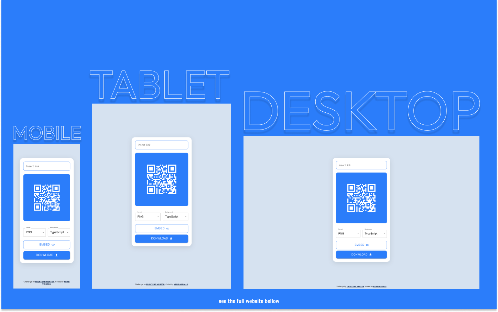

- Live Site URL: [https://kens-visuals.github.io/qr-code-generator/](https://kens-visuals.github.io/qr-code-generator/)
- Repository URL: [https://github.com/kens-visuals/qr-code-generator](https://github.com/kens-visuals/qr-code-generator)
- Solution URL: [https://www.frontendmentor.io/solutions/qr-code-generator-with-react-and-material-ui-XpZA7o_Ke](https://www.frontendmentor.io/solutions/qr-code-generator-with-react-and-material-ui-XpZA7o_Ke)

## Interactive Rating Component

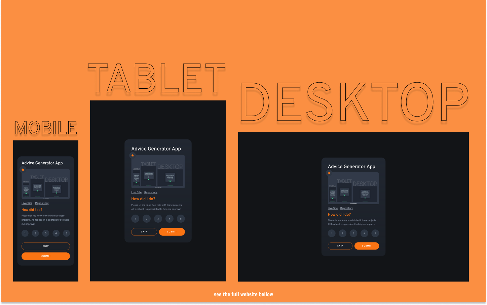

- Live Site URL: [https://kens-visuals.github.io/interactive-rating-component/](https://kens-visuals.github.io/interactive-rating-component/)
- Repository URL: [https://github.com/kens-visuals/interactive-rating-component](https://github.com/kens-visuals/interactive-rating-component)
- Solution URL: [https://www.frontendmentor.io/solutions/interactive-rating-component-solution-built-with-react-and-tailwindcss-B19iTMpG9](https://www.frontendmentor.io/solutions/interactive-rating-component-solution-built-with-react-and-tailwindcss-B19iTMpG9)

---

## Advice Generator App

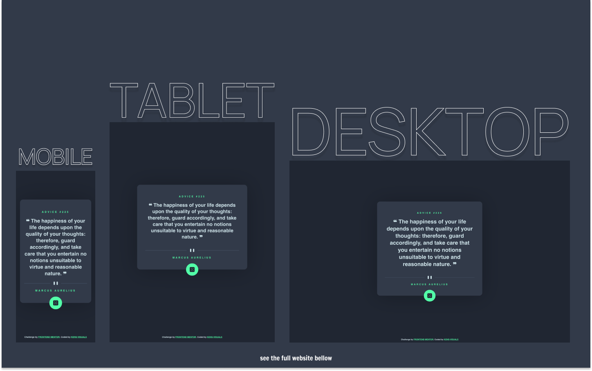

- Live Site URL: [https://kens-visuals.github.io/advice-generator-app/](https://kens-visuals.github.io/advice-generator-app/)
- Repository URL: [https://github.com/kens-visuals/advice-generator-app](https://github.com/kens-visuals/advice-generator-app)
- Solution URL: [https://www.frontendmentor.io/solutions/advice-generator-app-with-react-and-styled-components-CkRsCR7Q9](https://www.frontendmentor.io/solutions/advice-generator-app-with-react-and-styled-components-CkRsCR7Q9)

## NFT Preview Card Generator

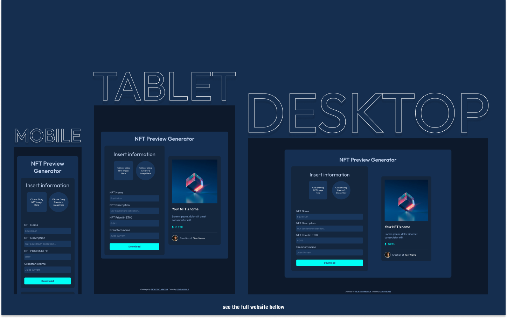

- Live Site URL: [https://kens-visuals.github.io/nft-preview-generator/](https://kens-visuals.github.io/nft-preview-generator/)
- Repository URL: [https://github.com/kens-visuals/nft-preview-generator](https://github.com/kens-visuals/nft-preview-generator)
- Solution URL: [https://www.frontendmentor.io/solutions/nft-preview-card-generator-built-with-react-and-styledcomponents-iLzEaKy_X](https://www.frontendmentor.io/solutions/nft-preview-card-generator-built-with-react-and-styledcomponents-iLzEaKy_X)

## Time Tracking Dashboard

- Live Site URL: [https://kens-visuals.github.io/time-tracking-dashboard/](https://kens-visuals.github.io/time-tracking-dashboard/)
- Repository URL: [https://github.com/kens-visuals/time-tracking-dashboard](https://github.com/kens-visuals/time-tracking-dashboard)
- Solution URL: [https://www.frontendmentor.io/solutions/time-tracking-dashboard-with-bem-scss-and-vanilla-js--5P53ADEz](https://www.frontendmentor.io/solutions/time-tracking-dashboard-with-bem-scss-and-vanilla-js--5P53ADEz)

## Tip Calculator App

- Live Site URL: [https://kens-visuals.github.io/tip-calculator-app/](https://kens-visuals.github.io/tip-calculator-app/)
- Repository URL: [https://github.com/kens-visuals/tip-calculator-app](https://github.com/kens-visuals/tip-calculator-app)
- Solution URL: [https://www.frontendmentor.io/solutions/splitter-tip-calculator-app-with-vanilla-js-scss-and-bem-4c6nu5szo](https://www.frontendmentor.io/solutions/splitter-tip-calculator-app-with-vanilla-js-scss-and-bem-4c6nu5szo)

## Sunnyside Agency Landing Page

- Live Site URL: [https://kens-visuals.github.io/sunnyside-agency-landing-page/](https://kens-visuals.github.io/sunnyside-agency-landing-page/)
- Repository URL: [https://github.com/kens-visuals/sunnyside-agency-landing-page](https://github.com/kens-visuals/sunnyside-agency-landing-page)
- Solution URL: [https://www.frontendmentor.io/solutions/sunnyside-agency-landing-page-with-scss-bem-css-grid-and-vanilla-js-uekvq0GuT](https://www.frontendmentor.io/solutions/sunnyside-agency-landing-page-with-scss-bem-css-grid-and-vanilla-js-uekvq0GuT)

## Blogr Landing Page

- Live Site URL: [https://kens-visuals.github.io/blogr-landing-page/](https://kens-visuals.github.io/blogr-landing-page/)
- Repository URL: [https://github.com/kens-visuals/blogr-landing-page](https://github.com/kens-visuals/blogr-landing-page)
- Solution URL: [https://www.frontendmentor.io/solutions/blogr-landin-page-with-scss-bem-and-vanilla-js-qyv7Cq02-](https://www.frontendmentor.io/solutions/blogr-landin-page-with-scss-bem-and-vanilla-js-qyv7Cq02-)

## Crowdfunding Product Page

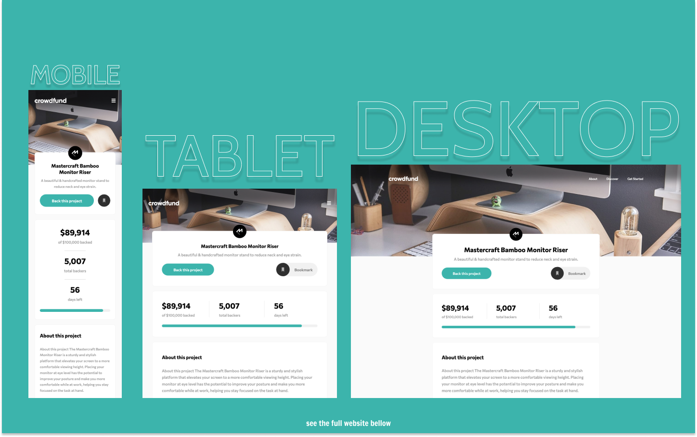

- Live Site URL: [https://kens-crowdfund.netlify.app/](https://kens-crowdfund.netlify.app/)
- Repository URL: [https://github.com/kens-visuals/crowdfunding-product-page](https://github.com/kens-visuals/crowdfunding-product-page)
- Solution URL: [https://www.frontendmentor.io/solutions/crowdfunding-product-page-with-vanilla-js-scss-and-bem-TWbk3JbR1](https://www.frontendmentor.io/solutions/crowdfunding-product-page-with-vanilla-js-scss-and-bem-TWbk3JbR1)

## Interactive Pricing Component

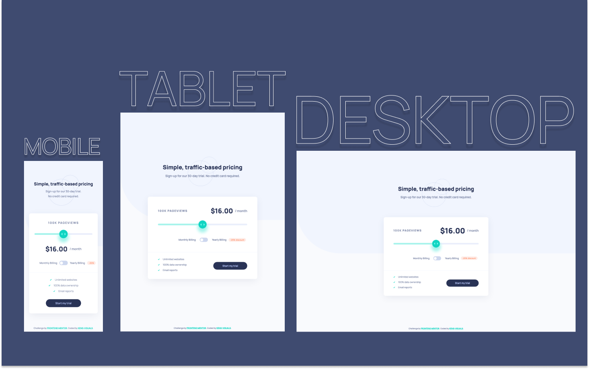

- Live Site URL: [https://kens-visuals.github.io/interactive-pricing-component/](https://kens-visuals.github.io/interactive-pricing-component/)
- Repository URL: [https://github.com/kens-visuals/interactive-pricing-component](https://github.com/kens-visuals/interactive-pricing-component)
- Solution URL: [https://www.frontendmentor.io/solutions/interactive-pricing-component-with-vanilla-js-scss-and-bem-TKxK-gb_9](https://www.frontendmentor.io/solutions/interactive-pricing-component-with-vanilla-js-scss-and-bem-TKxK-gb_9)

## Loopstudios Landing Page

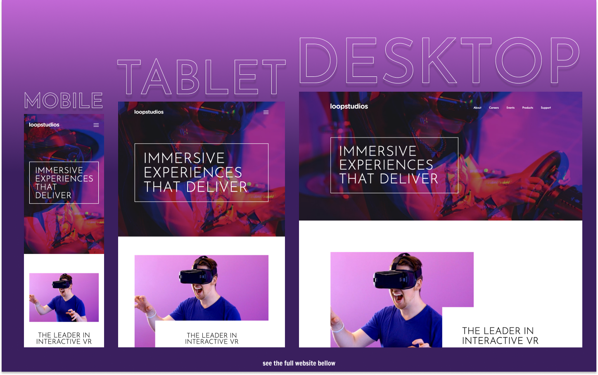

- Live Site URL: [https://kens-visuals.github.io/loopstudios-landing-page/](https://kens-visuals.github.io/loopstudios-landing-page/)
- Repository URL: [https://github.com/kens-visuals/loopstudios-landing-page](https://github.com/kens-visuals/loopstudios-landing-page)
- Solution URL: [https://www.frontendmentor.io/solutions/loopstudios-landing-page-with-vanilla-js-scss-and-bem-RUVC6Bett](https://www.frontendmentor.io/solutions/loopstudios-landing-page-with-vanilla-js-scss-and-bem-RUVC6Bett)

## Testimonials Grid Section

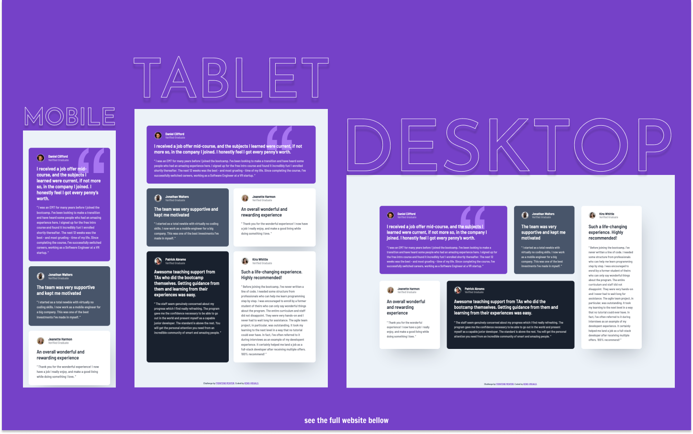

- Live Site URL: [https://kens-visuals.github.io/testimonials-grid-section/](https://kens-visuals.github.io/testimonials-grid-section/)
- Repository URL: [https://github.com/kens-visuals/testimonials-grid-section](https://github.com/kens-visuals/testimonials-grid-section)
- Solution URL: [https://www.frontendmentor.io/solutions/testimonials-grid-section-with-scss-bem-and-css-grid-dr2f83Qua](https://www.frontendmentor.io/solutions/testimonials-grid-section-with-scss-bem-and-css-grid-dr2f83Qua)

## Fylo Data Storage Component

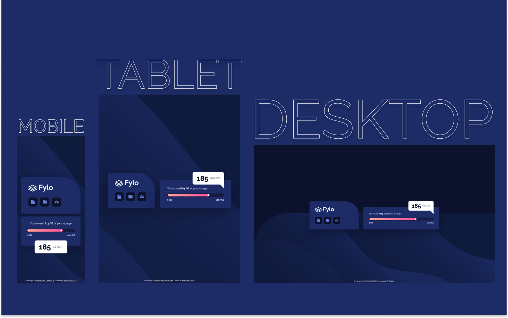

- Live Site URL: [https://kens-visuals.github.io/fylo-data-storage-component/](https://kens-visuals.github.io/fylo-data-storage-component/)
- Repository URL: [https://github.com/kens-visuals/fylo-data-storage-component](https://github.com/kens-visuals/fylo-data-storage-component)
- Solution URL: [https://www.frontendmentor.io/solutions/fylo-data-storage-component-with-css-animations-scss-and-bem-Jc1s4LmUs](https://www.frontendmentor.io/solutions/fylo-data-storage-component-with-css-animations-scss-and-bem-Jc1s4LmUs)

## Coding Bootcamp Testimonials Slider

- Live Site URL: [https://kens-visuals.github.io/coding-bootcamp-testimonials-slider/](https://kens-visuals.github.io/coding-bootcamp-testimonials-slider/)
- Repository URL: [https://github.com/kens-visuals/coding-bootcamp-testimonials-slider](https://github.com/kens-visuals/coding-bootcamp-testimonials-slider)
- Solution URL: [https://www.frontendmentor.io/solutions/coding-bootcamp-testimonials-slider-with-vanilla-js-scss-and-bem-pHSco0Ue0](https://www.frontendmentor.io/solutions/coding-bootcamp-testimonials-slider-with-vanilla-js-scss-and-bem-pHSco0Ue0)

## Social Media Dashboard with Theme Switcher

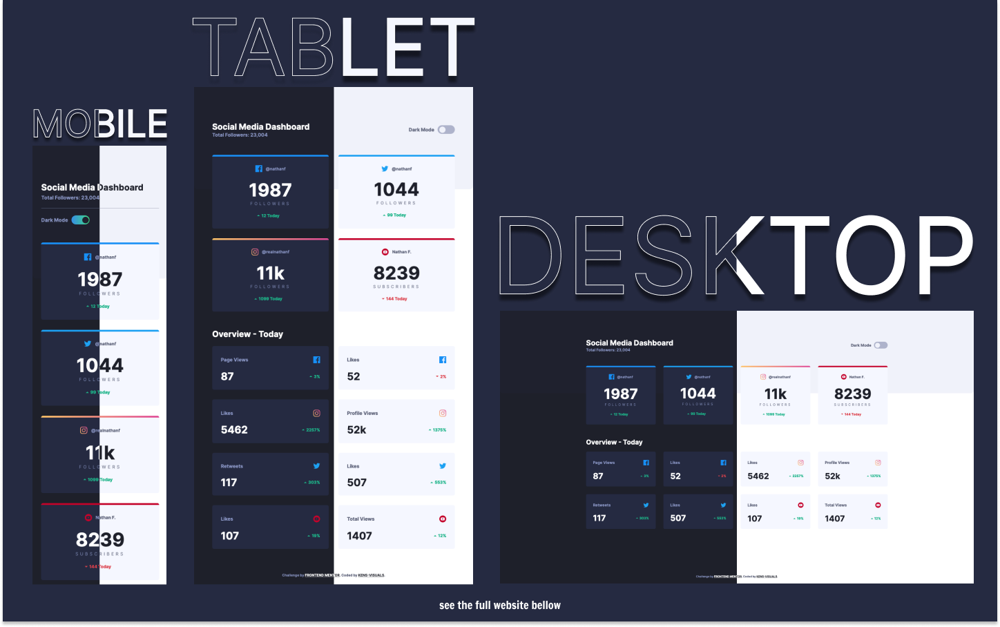

- Live Site URL: [https://kens-visuals.github.io/social-media-dashboard/](https://kens-visuals.github.io/social-media-dashboard/)
- Repository URL: [https://github.com/kens-visuals/social-media-dashboard](https://github.com/kens-visuals/social-media-dashboard)
- Solution URL: [https://www.frontendmentor.io/solutions/social-media-dashboard-with-theme-switcher-built-with-vanilla-js-VHewUlX1Y](https://www.frontendmentor.io/solutions/social-media-dashboard-with-theme-switcher-built-with-vanilla-js-VHewUlX1Y)

## Insure Landing Page

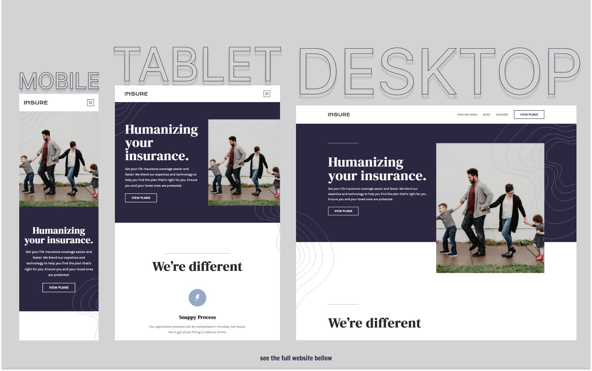

- Live Site URL: [https://kens-visuals.github.io/insure-landing-page/](https://kens-visuals.github.io/insure-landing-page/)
- Repository URL: [https://github.com/kens-visuals/insure-landing-page](https://github.com/kens-visuals/insure-landing-page)
- Solution URL: [https://www.frontendmentor.io/solutions/insure-landing-page-with-scss-bem-css-animations-and-vanilla-js-tlFb95NjO](https://www.frontendmentor.io/solutions/insure-landing-page-with-scss-bem-css-animations-and-vanilla-js-tlFb95NjO)

## Pricing Component with Toggle

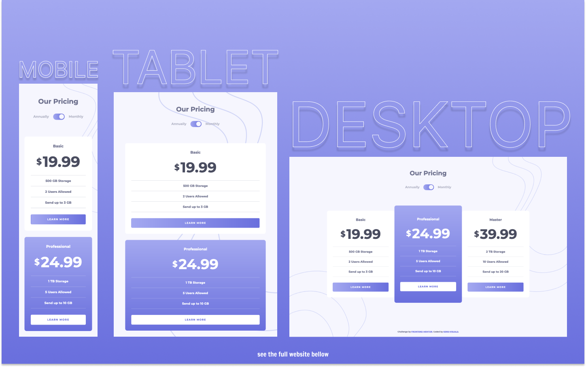

- Live Site URL: [https://kens-visuals.github.io/pricing-component-with-toggle/](https://kens-visuals.github.io/pricing-component-with-toggle/)
- Repository URL: [https://github.com/kens-visuals/pricing-component-with-toggle](https://github.com/kens-visuals/pricing-component-with-toggle)
- Solution URL: [https://www.frontendmentor.io/solutions/pricing-component-with-toggle-with-vanilla-js-scss-and-bem-ylbwbfjvO](https://www.frontendmentor.io/solutions/pricing-component-with-toggle-with-vanilla-js-scss-and-bem-ylbwbfjvO)

## Project Tracking Intro Component

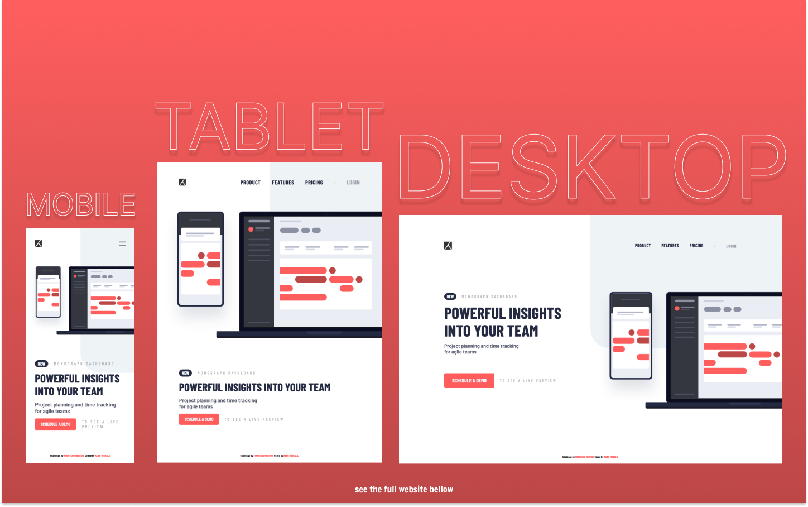

- Live Site URL: [https://kens-visuals.github.io/project-tracking-intro-component/](https://kens-visuals.github.io/project-tracking-intro-component/)
- Repository URL: [https://github.com/kens-visuals/project-tracking-intro-component](https://github.com/kens-visuals/project-tracking-intro-component)
- Solution URL: [https://www.frontendmentor.io/solutions/project-tracking-intro-component-with-scss-css-animations-and-bem-pdiPZBEWn](https://www.frontendmentor.io/solutions/project-tracking-intro-component-with-scss-css-animations-and-bem-pdiPZBEWn)

## Clipboard Landing Page

- Live Site URL: [https://kens-visuals.github.io/clipboard-landing-page/](https://kens-visuals.github.io/clipboard-landing-page/)
- Repository URL: [https://github.com/kens-visuals/clipboard-landing-page](https://github.com/kens-visuals/clipboard-landing-page)
- Solution URL: [https://www.frontendmentor.io/solutions/clipboard-landing-page-with-scss-bem-and-vanilla-js-5i5L0KYqw](https://www.frontendmentor.io/solutions/clipboard-landing-page-with-scss-bem-and-vanilla-js-5i5L0KYqw)

## Huddle Landing Page with Blocks

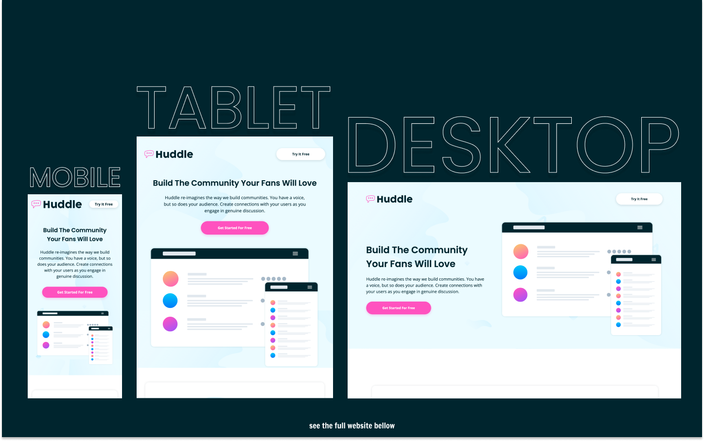

- Live Site URL: [https://kens-visuals.github.io/huddle-landing-page-with-blocks/](https://kens-visuals.github.io/huddle-landing-page-with-blocks/)
- Repository URL: [https://github.com/kens-visuals/huddle-landing-page-with-blocks](https://github.com/kens-visuals/huddle-landing-page-with-blocks)
- Solution URL: [https://www.frontendmentor.io/solutions/huddle-landing-page-with-blocks-built-with-scss-bem-and-vanilla-js-Z6zhfo-X8](https://www.frontendmentor.io/solutions/huddle-landing-page-with-blocks-built-with-scss-bem-and-vanilla-js-Z6zhfo-X8)

## Fylo Dark Theme Landing Page

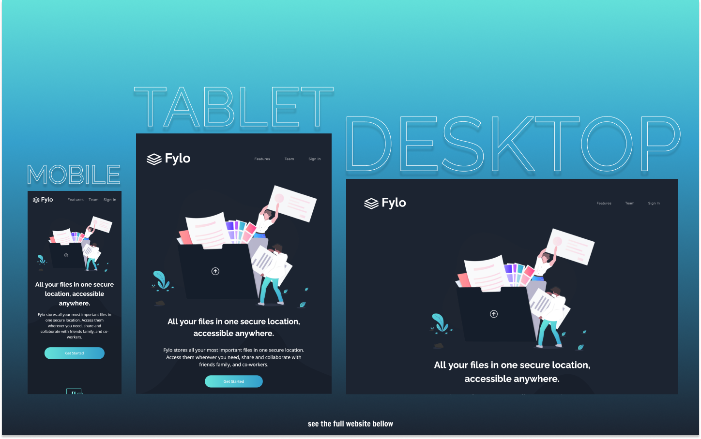

- Live Site URL: [https://kens-visuals.github.io/fylo-dark-theme-landing-page/](https://kens-visuals.github.io/fylo-dark-theme-landing-page/)
- Repository URL: [https://github.com/kens-visuals/fylo-dark-theme-landing-page](https://github.com/kens-visuals/fylo-dark-theme-landing-page)
- Solution URL: [https://www.frontendmentor.io/solutions/fylo-dark-theme-landing-page-with-vanilla-js-scss-and-bem-KaoA6v6wj](https://www.frontendmentor.io/solutions/fylo-dark-theme-landing-page-with-vanilla-js-scss-and-bem-KaoA6v6wj)

## Fylo Landing Page

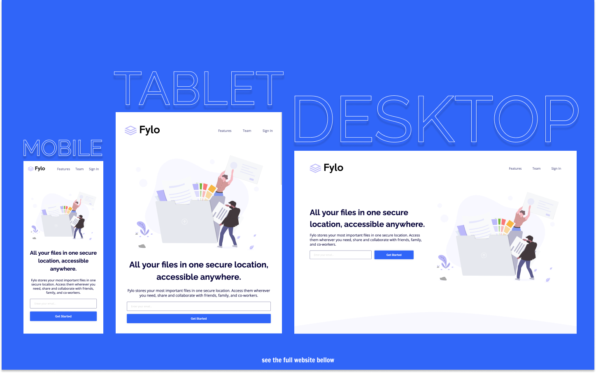

- Live Site URL: [https://kens-visuals.github.io/fylo-landing-page/](https://kens-visuals.github.io/fylo-landing-page/)
- Repository URL: [https://github.com/kens-visuals/fylo-landing-page](https://github.com/kens-visuals/fylo-landing-page)
- Solution URL: [https://www.frontendmentor.io/solutions/fylo-landing-page-with-vanilla-js-scss-and-bem-j3_o-hMup](https://www.frontendmentor.io/solutions/fylo-landing-page-with-vanilla-js-scss-and-bem-j3_o-hMup)

## Huddle Landing Page with Curves

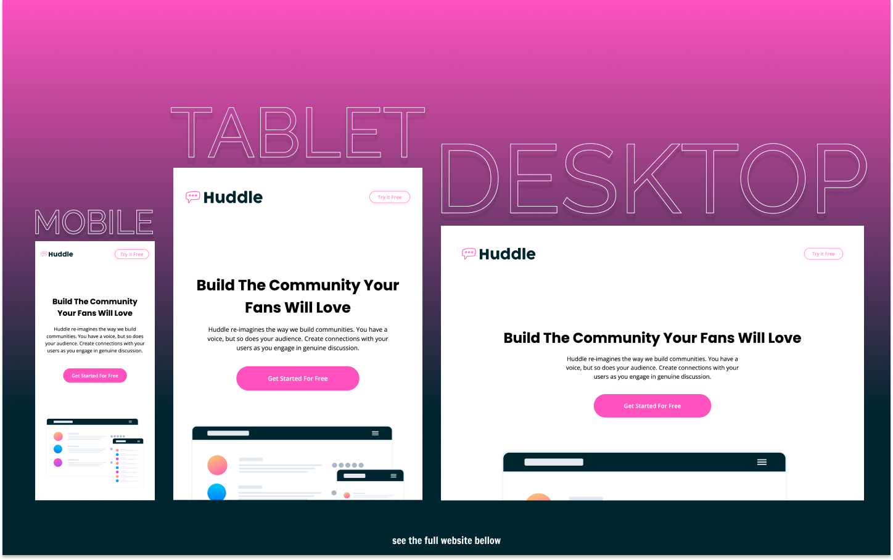

- Live Site URL: [https://kens-visuals.github.io/huddle-landing-page-with-curves/](https://kens-visuals.github.io/huddle-landing-page-with-curves/)
- Repository URL: [https://github.com/kens-visuals/huddle-landing-page-with-curves](https://github.com/kens-visuals/huddle-landing-page-with-curves)
- Solution URL: [https://www.frontendmentor.io/solutions/huddle-landing-page-with-curves-built-with-vanilla-js-scss-and-bem-AUV7QIWYs](https://www.frontendmentor.io/solutions/huddle-landing-page-with-curves-built-with-vanilla-js-scss-and-bem-AUV7QIWYs)

---

## E-Commerce Product Page

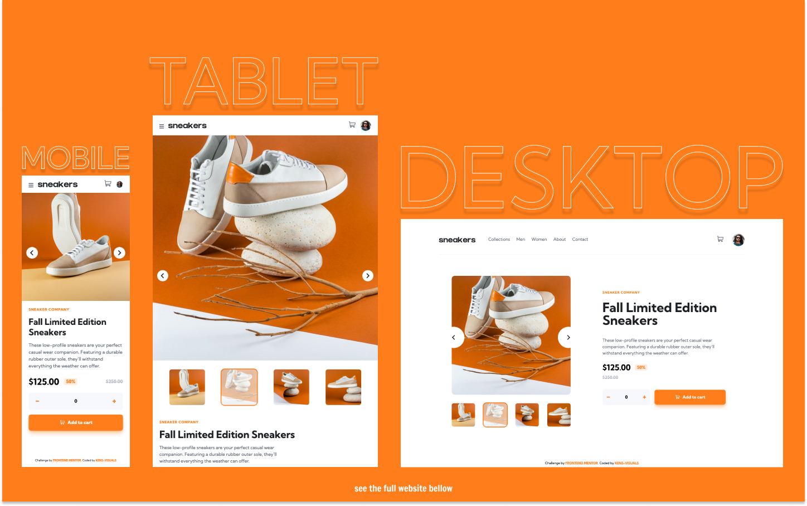

- Live Site URL: [https://kens-visuals.github.io/ecommerce-product-page/](https://kens-visuals.github.io/ecommerce-product-page/)
- Repository URL: [https://github.com/kens-visuals/ecommerce-product-page](https://github.com/kens-visuals/ecommerce-product-page)
- Solution URL: [https://www.frontendmentor.io/solutions/ecommerce-product-page-built-w-react-and-tailwind-css-Ska7C_9N9](https://www.frontendmentor.io/solutions/ecommerce-product-page-built-w-react-and-tailwind-css-Ska7C_9N9)

## Calculator App

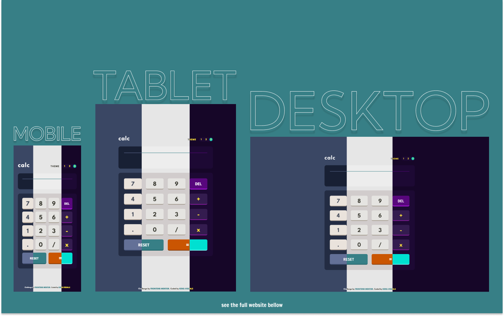

- Live Site URL: [https://kens-visuals.github.io/calculator-app/](https://kens-visuals.github.io/calculator-app/)
- Repository URL: [https://github.com/kens-visuals/calculator-app](https://github.com/kens-visuals/calculator-app)
- Solution URL: [https://www.frontendmentor.io/solutions/calculator-app-built-with-react-and-tailwindcss-S1tYTCe85](https://www.frontendmentor.io/solutions/calculator-app-built-with-react-and-tailwindcss-S1tYTCe85)

## Todo App

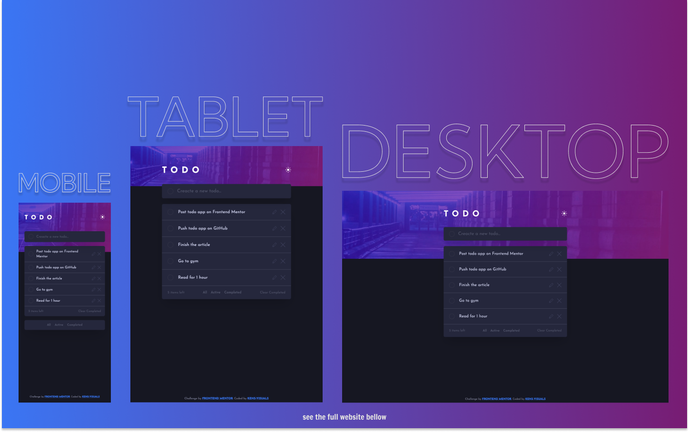

- Live Site URL: [https://kens-visuals.github.io/todo-app/](https://kens-visuals.github.io/todo-app/)
- Repository URL: [https://github.com/kens-visuals/todo-app](https://github.com/kens-visuals/todo-app)
- Solution URL: [https://www.frontendmentor.io/solutions/todo-app-built-with-react-and-tailwind-css-rJrsKyJPc](https://www.frontendmentor.io/solutions/todo-app-built-with-react-and-tailwind-css-rJrsKyJPc)

## Markdown Notes App

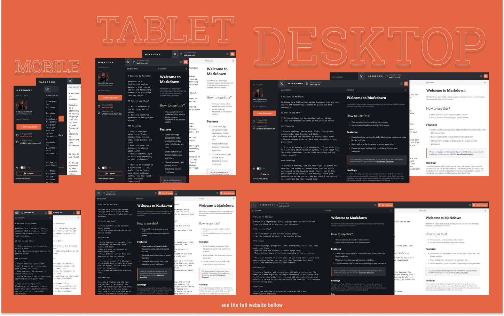

- Live Site URL: [https://markdown-notes-app-delta.vercel.app/](https://markdown-notes-app-delta.vercel.app/)
- Repository URL: [https://github.com/kens-visuals/markdown-notes-app](https://github.com/kens-visuals/markdown-notes-app)
- Solution URL: [https://www.frontendmentor.io/solutions/markdown-editor-app-built-with-nextjs-tailwindcss-and-firebase-N-SvSRipHi](https://www.frontendmentor.io/solutions/markdown-editor-app-built-with-nextjs-tailwindcss-and-firebase-N-SvSRipHi)
