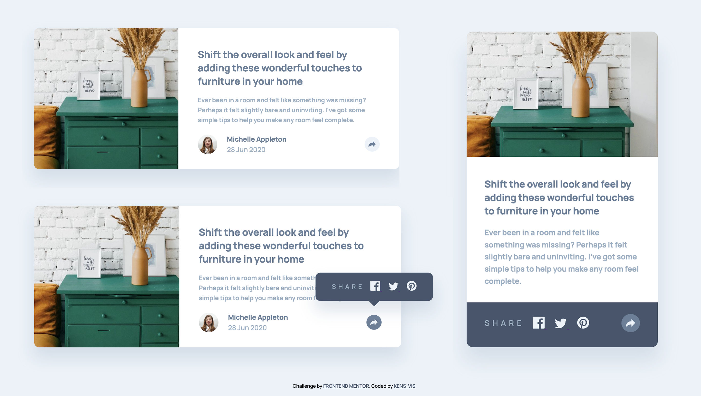
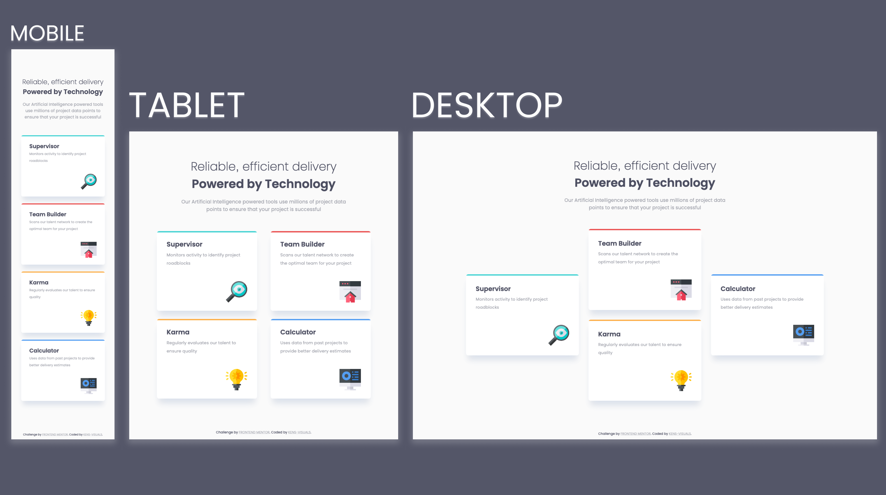
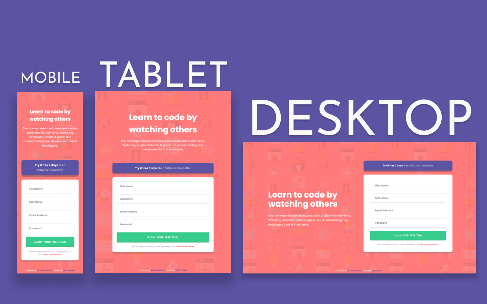
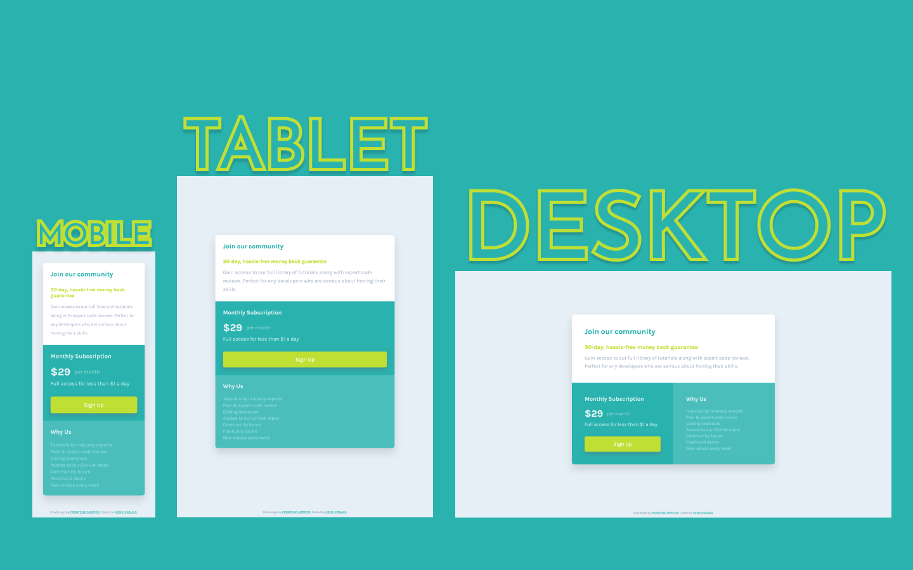
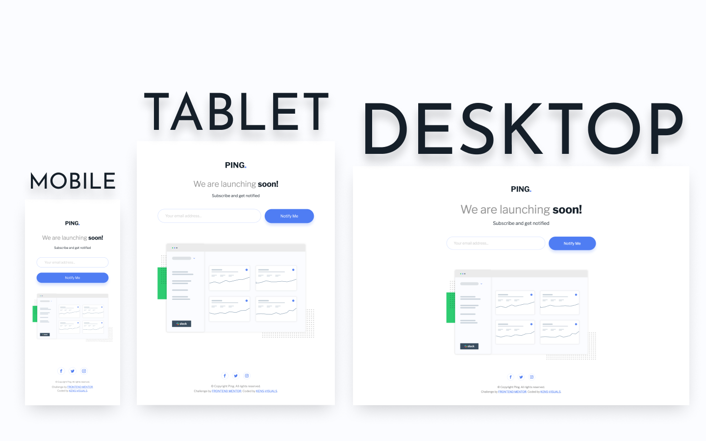
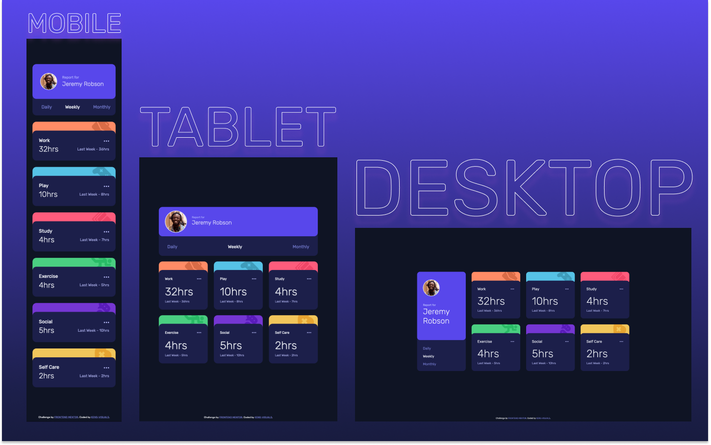
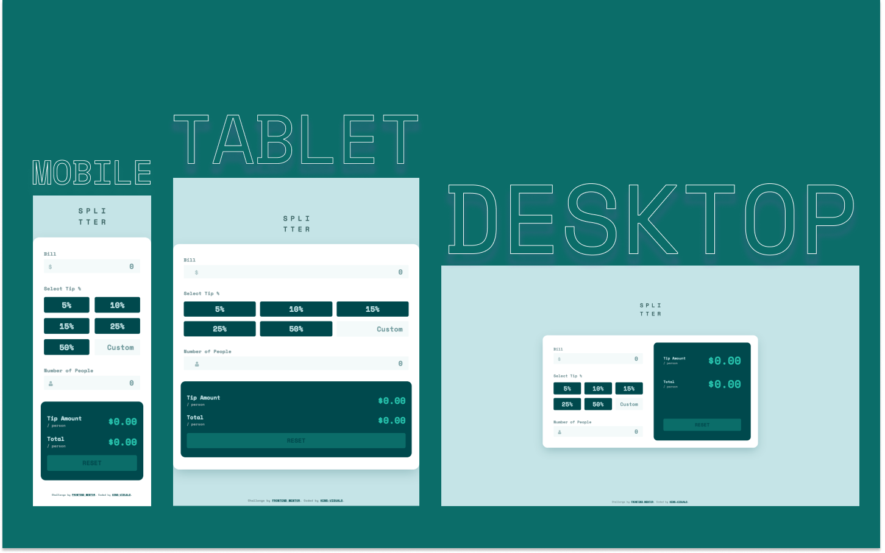
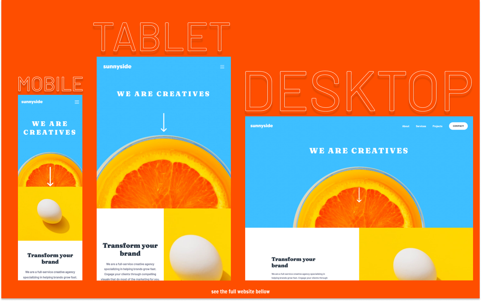
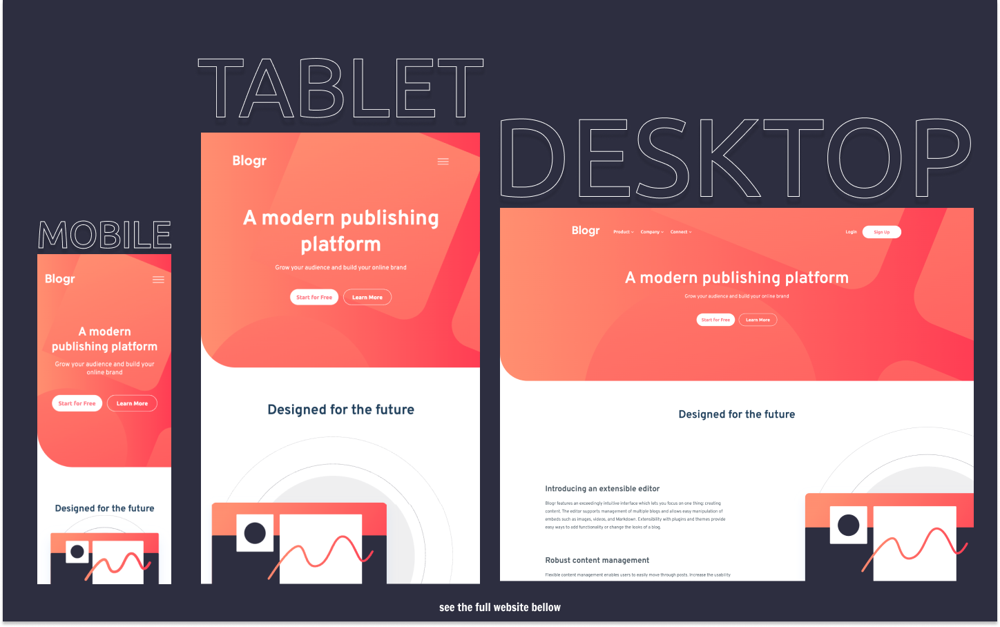

# Frontend Mentor Solutions 👨🏻‍💻

I've challenged myself to a **30-DAY-CSS-CHALLENGE,** and what other way than using Frontend Mentor's beautiful designs. I wanted this to be as challenging as it gets, hence I purposely didn't buy the pro version of Frontend Mentor's subscription, so I don't have access to any design files relying only on my vision and approximation.

> Programming is like any other sport. You might know the rules, but you have to play to learn. -- Mark Zuckerberg

| Difficulty | Table of Contents                                                     |
| ---------- | --------------------------------------------------------------------- |
| NEWBIE     | [Order Summary Component](#order-summary-component)                   |
| NEWBIE     | [3 Column Preview Card Component](#column-preview-card-component)     |
| NEWBIE     | [Profile Card Component](#profile-card-component)                     |
| NEWBIE     | [FAQ Accordion Card](#faq-accordion-card)                             |
| NEWBIE     | [Stats Preview Card Component](#stats-preview-card-component)         |
| NEWBIE     | [Social Proof Section](#social-proof-section)                         |
| NEWBIE     | [Article Preview Component](#article-preview-component)               |
| NEWBIE     | [Four Card Feature Section](#four-card-feature-section)               |
| NEWBIE     | [Base Apparel Coming Soon](#base-apparel-coming-soon)                 |
| NEWBIE     | [Intro Component With Signup Form](#intro-component-with-signup-form) |
| NEWBIE     | [Single Price Grid Component](#single-price-grid-component)           |
| NEWBIE     | [Ping Coming Soon Page](#ping-coming-soon-page)                       |
| NEWBIE     | [Huddle Landing Page](#huddle-landing-page)                           |
|            |                                                                       |
| JUNIOR     | [Time Tracking Dashboard](#time-tracking-dashboard)                   |
| JUNIOR     | [Tip Calculator App](#tip-calculator-app)                             |
| JUNIOR     | [Sunnyside Agency Landing Page](#sunnyside-agency-landing-page)       |
| JUNIOR     | [Blogr Landing Page](#blogr-landing-page)                             |

## Order Summary Component

- Live Site URL: [https://kens-visuals.github.io/order-summary-component/](https://kens-visuals.github.io/order-summary-component/)
- Repository URL: [https://github.com/kens-visuals/order-summary-component](https://github.com/kens-visuals/order-summary-component)
- Solution URL: [https://www.frontendmentor.io/solutions/basic-card-component-using-sass-preprocessor-and-bem-naming-convention-029xmfY6X](https://www.frontendmentor.io/solutions/basic-card-component-using-sass-preprocessor-and-bem-naming-convention-029xmfY6X)

## 3 Column Preview Card Component

- Live Site URL: [https://kens-visuals.github.io/3-column/](https://kens-visuals.github.io/3-column/)
- Repository URL: [https://github.com/kens-visuals/3-column](https://github.com/kens-visuals/3-column)
- Solution URL: [https://www.frontendmentor.io/solutions/css-custom-properties-css-flexbox-css-grid-xOljzZQUJ](https://www.frontendmentor.io/solutions/css-custom-properties-css-flexbox-css-grid-xOljzZQUJ)

## Profile Card Component

- Live Site URL: [https://kens-visuals.github.io/profile-card-component/](https://kens-visuals.github.io/profile-card-component/)
- Repository URL: [https://github.com/kens-visuals/profile-card-component](https://github.com/kens-visuals/profile-card-component)
- Solution URL: [https://www.frontendmentor.io/solutions/simple-profile-card-component-built-with-scss-HwtVCsqjH](https://www.frontendmentor.io/solutions/simple-profile-card-component-built-with-scss-HwtVCsqjH)

## FAQ Accordion Card

- Live Site URL: [https://kens-visuals.github.io/faq-accordion-card/](https://kens-visuals.github.io/faq-accordion-card/)
- Repository URL: [https://github.com/kens-visuals/faq-accordion-card](https://github.com/kens-visuals/faq-accordion-card)
- Solution URL: [https://www.frontendmentor.io/solutions/faq-accordion-card-in-pure-html-and-scss-9OePi0oj-](https://www.frontendmentor.io/solutions/faq-accordion-card-in-pure-html-and-scss-9OePi0oj-)

## Stats Preview Card Component

- Live Site URL: [https://kens-visuals.github.io/stats-preview/](https://kens-visuals.github.io/stats-preview/)
- Repository URL: [https://github.com/kens-visuals/stats-preview](https://github.com/kens-visuals/stats-preview)
- Solution URL: [https://www.frontendmentor.io/solutions/stats-card-component-using-bem-and-scss-Xoknc8IAa](https://www.frontendmentor.io/solutions/stats-card-component-using-bem-and-scss-Xoknc8IAa)

## Social Proof Section

- Live Site URL: [https://kens-visuals.github.io/social-proof-section/](https://kens-visuals.github.io/social-proof-section/)
- Repository URL: [https://github.com/kens-visuals/social-proof-section](https://github.com/kens-visuals/social-proof-section)
- Solution URL: [https://www.frontendmentor.io/solutions/social-proof-section-with-css-grid-flexbox-bem-and-scss-h-SsLpwkF](https://www.frontendmentor.io/solutions/social-proof-section-with-css-grid-flexbox-bem-and-scss-h-SsLpwkF)

## Article Preview Component

- Live Site URL: [https://kens-visuals.github.io/article-preview-component/#](https://kens-visuals.github.io/article-preview-component/#)
- Repository URL: [https://github.com/kens-visuals/article-preview-component](https://github.com/kens-visuals/article-preview-component)
- Solution URL: [https://www.frontendmentor.io/solutions/article-preview-comp-with-bem-sass-and-vanilla-js-vtLeoLZH4](https://www.frontendmentor.io/solutions/article-preview-comp-with-bem-sass-and-vanilla-js-vtLeoLZH4)

## Four Card Feature Section

- Live Site URL: [https://kens-visuals.github.io/four-card-feature-section/](https://kens-visuals.github.io/four-card-feature-section/)
- Repository URL: [https://github.com/kens-visuals/four-card-feature-section](https://github.com/kens-visuals/four-card-feature-section)
- Solution URL: [https://www.frontendmentor.io/solutions/four-card-feature-section-with-bem-and-scss-YfhlZvokE](https://www.frontendmentor.io/solutions/four-card-feature-section-with-bem-and-scss-YfhlZvokE)

## Base Apparel Coming Soon

- Live Site URL: [https://kens-visuals.github.io/base-apparel-coming-soon/](https://kens-visuals.github.io/base-apparel-coming-soon/)
- Repository URL: [https://github.com/kens-visuals/base-apparel-coming-soon](https://github.com/kens-visuals/base-apparel-coming-soon)
- Solution URL: [https://www.frontendmentor.io/solutions/base-apparel-coming-soon-with-vanilla-js-scss-and-bem-mbo9r7UHp](https://www.frontendmentor.io/solutions/base-apparel-coming-soon-with-vanilla-js-scss-and-bem-mbo9r7UHp)

## Intro Component With Signup Form

- Live Site URL: [https://kens-visuals.github.io/intro-component-with-signup-form/](https://kens-visuals.github.io/intro-component-with-signup-form/)
- Repository URL: [https://github.com/kens-visuals/intro-component-with-signup-form](https://github.com/kens-visuals/intro-component-with-signup-form)
- Solution URL: [https://www.frontendmentor.io/solutions/intro-comp-with-signup-form-built-with-scss-bem-and-vanilla-js-aIoqL7r_n](https://www.frontendmentor.io/solutions/intro-comp-with-signup-form-built-with-scss-bem-and-vanilla-js-aIoqL7r_n)

## Single Price Grid Component

- Live Site URL: [https://kens-visuals.github.io/single-price-grid-component/](https://kens-visuals.github.io/single-price-grid-component/)
- Repository URL: [https://github.com/kens-visuals/single-price-grid-component](https://github.com/kens-visuals/single-price-grid-component)
- Solution URL: [https://www.frontendmentor.io/solutions/single-price-grid-component-with-no-media-queries-dcVj96LxV](https://www.frontendmentor.io/solutions/single-price-grid-component-with-no-media-queries-dcVj96LxV)

## Ping Coming Soon Page

- Live Site URL: [https://kens-visuals.github.io/ping-coming-soon-page/](https://kens-visuals.github.io/ping-coming-soon-page/)
- Repository URL: [https://github.com/kens-visuals/ping-coming-soon-page](https://github.com/kens-visuals/ping-coming-soon-page)
- Solution URL: [https://www.frontendmentor.io/solutions/ping-coming-soon-page-with-bem-scss-and-vanilla-js-Zoi6yA_6s](https://www.frontendmentor.io/solutions/ping-coming-soon-page-with-bem-scss-and-vanilla-js-Zoi6yA_6s)

## Huddle Landing Page

- Live Site URL: [https://kens-visuals.github.io/huddle-landing-page/](https://kens-visuals.github.io/huddle-landing-page/)
- Repository URL: [https://github.com/kens-visuals/huddle-landing-page#screenshot](https://github.com/kens-visuals/huddle-landing-page#screenshot)
- Solution URL: [https://www.frontendmentor.io/solutions/huddle-landing-page-with-scss-bem-and-css-flexbox-xDNM9FSFX](https://www.frontendmentor.io/solutions/huddle-landing-page-with-scss-bem-and-css-flexbox-xDNM9FSFX)

## Time Tracking Dashboard

- Live Site URL: [https://kens-visuals.github.io/time-tracking-dashboard/](https://kens-visuals.github.io/time-tracking-dashboard/)
- Repository URL: [https://github.com/kens-visuals/time-tracking-dashboard](https://github.com/kens-visuals/time-tracking-dashboard)
- Solution URL: [https://www.frontendmentor.io/solutions/time-tracking-dashboard-with-bem-scss-and-vanilla-js--5P53ADEz](https://www.frontendmentor.io/solutions/time-tracking-dashboard-with-bem-scss-and-vanilla-js--5P53ADEz)

## Tip Calculator App

- Live Site URL: [https://kens-visuals.github.io/tip-calculator-app/](https://kens-visuals.github.io/tip-calculator-app/)
- Repository URL: [https://github.com/kens-visuals/tip-calculator-app](https://github.com/kens-visuals/tip-calculator-app)
- Solution URL: [https://www.frontendmentor.io/solutions/splitter-tip-calculator-app-with-vanilla-js-scss-and-bem-4c6nu5szo](https://www.frontendmentor.io/solutions/splitter-tip-calculator-app-with-vanilla-js-scss-and-bem-4c6nu5szo)

## Sunnyside Agency Landing Page

- Live Site URL: [https://kens-visuals.github.io/sunnyside-agency-landing-page/](https://kens-visuals.github.io/sunnyside-agency-landing-page/)
- Repository URL: [https://github.com/kens-visuals/sunnyside-agency-landing-page](https://github.com/kens-visuals/sunnyside-agency-landing-page)
- Solution URL: [https://www.frontendmentor.io/solutions/sunnyside-agency-landing-page-with-scss-bem-css-grid-and-vanilla-js-uekvq0GuT](https://www.frontendmentor.io/solutions/sunnyside-agency-landing-page-with-scss-bem-css-grid-and-vanilla-js-uekvq0GuT)

## Blogr Landing Page

- Live Site URL: [https://kens-visuals.github.io/blogr-landing-page/](https://kens-visuals.github.io/blogr-landing-page/)
- Repository URL: [https://github.com/kens-visuals/blogr-landing-page](https://github.com/kens-visuals/blogr-landing-page)
- Solution URL: [https://www.frontendmentor.io/solutions/blogr-landin-page-with-scss-bem-and-vanilla-js-qyv7Cq02-](https://www.frontendmentor.io/solutions/blogr-landin-page-with-scss-bem-and-vanilla-js-qyv7Cq02-)
